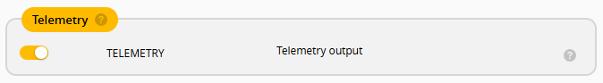
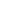

# edgetx-telemetry-dashboard
A modern telemetry dashboard widget for EdgeTX colour screen radios.

# EdgeTX Widgets Installation Guide

This guide explains how to install and configure the `FPVDASH` widget from this repository on an EdgeTX-compatible transmitter.


## Prerequisites

1. EdgeTX firmware installed on your radio.
2. A valid EdgeTX SD card contents pack for your firmware version.
3. In Betaflight, enable **Telemetry Output** in the **Receiver** tab.



4. A model with telemetry sensors discovered (recommended before final widget setup).
5. Supported target radios:

   **Primary target — 480 × 320 px:**
   RadioMaster TX15, TX15 Max · Jumper T15, T15 Pro

   **Compatible — 480 × 272 px:**
   RadioMaster TX16S, TX16S Mark II · Jumper T16, T18

## Installation Steps

### 1. Download the Widget Files
1. Clone or download this repository.
2. Use the `SCRIPTS/WIDGETS/FPVDASH` folder from this project.

### 2. Copy Files to the SD Card
1. Connect the radio to your computer with USB.
2. On the radio, select `USB Storage (SD)`.
3. Open the mounted SD card and go to `/WIDGETS/`.
4. Copy the `FPVDASH` folder (from `SCRIPTS/WIDGETS/FPVDASH` in this repo) into `/WIDGETS/`.
5. Confirm the final runtime path exists:
	 `/WIDGETS/FPVDASH/`

### 3. Bind and Discover Sensors
1. Power on radio and receiver.
2. Open **Model Settings** -> **Telemetry**.
3. Select **Discover new sensors** and wait for completion.
4. Optionally select **Stop discovery** and then **Delete all sensors / Rediscover** if sensor mapping looks stale.

### 4. Load the Widget on the Transmitter
1. Open the model display screen where you want the dashboard.
2. Enter widget layout setup (long press `PAGE` on most radios).
3. Select the telemetry screen and set it to `App Mode`.
4. Select a widget zone and choose `Telemetry Dashboard` (FPVDASH).


### 5. Configure Widget Options
The widget currently provides these options:
1. `darkTheme` (`BOOL`):
	 `On` = dark mode, `Off` = light mode.
2. `transpLevel` (`COMBO` where supported):
	 Controls section overlay transparency.


### 6. Test the Widget
1. Exit setup screens.
2. Verify top bar, sticks, context telemetry, timers, and footer render correctly.
3. Check live updates for LQ, RSSI, packet rate, battery, and satellite status.

## Telemetry Screen Setup (App Mode Required)

`FPVDASH` must be loaded on a telemetry screen configured in `App Mode`.
If the screen is not in `App Mode`, the widget may not load or may not render correctly.

## Widget Overview

`FPVDASH` is a full dashboard widget that includes:
- Model name and TX battery (top bar)
- Link status and key telemetry indicators
- Stick monitor
- Context telemetry grid (current, power, RF mode/packet rate, RSSI, satellites, antenna, flight mode)
- Timers row
- Footer with ELRS version and EdgeTX version

## Context Telemetry Metrics

The context section displays secondary telemetry used for pre-flight validation and post-flight analysis.
These metrics complement the primary safety indicators such as battery and link quality shown elsewhere in the dashboard.

###  CUR - Current (Amps)

What it shows:
Real-time current draw from the flight controller.

Why it matters:
Detects electrical issues before takeoff.

Typical values:
- Pre-flight: 0-1A
- Idle (armed, no throttle): 1-5A
- Hover: 5-20A depending on build

Warning signs:
- High current at idle can indicate motor, ESC, or short issues.
- Sudden spikes can indicate prop or wiring problems.

Usage:
- Pre-flight safety check
- Post-flight power analysis

###  RFMD - Packet Rate (Hz)

What it shows:
ExpressLRS packet rate decoded from RFMD telemetry.

Why it matters:
Confirms your control link configuration.

Typical values:
- 25 Hz
- 50 Hz
- 100 Hz
- 150 Hz
- 250 Hz
- 500 Hz
- 1000 Hz

Warning signs:
- Wrong rate can indicate an incorrect model profile.
- Unexpected changes can indicate dynamic mode issues.

Usage:
- Pre-flight configuration check

###  TPWR - TX Power (mW)

What it shows:
Current transmitter output power.

Why it matters:
Indicates link strength and dynamic power behavior.

Typical values:
- 10-1000 mW depending on setup

Warning signs:
- Stuck at low power can indicate a configuration issue.
- Constantly maxed-out power can indicate poor signal or antenna issues.

Usage:
- Pre-flight link validation
- Post-flight RF diagnostics

###  RSSI - Signal Strength (Best Antenna)

What it shows:
The best RSSI value from receiver antennas.

Why it matters:
Measures raw signal strength.

Typical values:
- -50 to -80 dBm: strong
- -90 to -100 dBm: weak

Warning signs:
- Very low RSSI can indicate an antenna issue.
- Large fluctuations can indicate interference or orientation problems.

Usage:
- Link diagnostics
- Antenna troubleshooting

###  SATS - GPS Satellites

What it shows:
Number of GPS satellites detected.

Why it matters:
Determines GPS reliability for functions such as return-to-home and position hold.

Typical values:
- 0: no lock
- 1-4: poor
- 5-7: usable
- 8+: good

Special cases:
- `N/A`: no telemetry or GPS not detected

Usage:
- Pre-flight GPS readiness
- Post-flight GPS performance

###  FM - Flight Mode

What it shows:
Current flight mode from the flight controller.

Why it matters:
Prevents arming in the wrong mode.

Typical values:
- ANGLE
- HORIZON
- AIR
- ACRO

Warning signs:
- Unexpected mode can indicate switch misconfiguration.

Usage:
- Pre-flight verification

###  RSNR - Signal-to-Noise Ratio (dB)

What it shows:
Quality of the radio signal relative to background noise.

Why it matters:
Often more informative than RSSI alone for link quality.

Typical values:
- Greater than 10 dB: excellent
- 5-10 dB: good
- 0-5 dB: weak
- Less than 0 dB: poor

Warning signs:
- Low RSNR with good RSSI can indicate interference.
- Negative values can indicate an unstable link.

Usage:
- Link quality diagnostics
- Interference detection

###  CAP - Consumed Capacity (mAh)

What it shows:
Battery capacity consumed during the flight.

Why it matters:
Helps evaluate energy consumption and battery planning.

Typical values:
- Depends on battery size and flight style, for example 500-1500 mAh

Warning signs:
- Very high consumption can indicate an inefficient setup.
- Very low readings can indicate the sensor is not configured.

Usage:
- Post-flight analysis
- Battery planning

### Summary

The context section is intended to answer these operational questions:
- Is the drone safe to arm?
- Is the link configured and stable?
- Is the GPS ready?
- Did the system behave correctly after the flight?

In practice, it groups into:
- Pre-flight safety checks: CUR, RFMD, TPWR, SATS, FM
- Link diagnostics: RSSI, RSNR
- Post-flight insight: CAP

## Troubleshooting

- Widget not visible:
	Confirm files are under `/WIDGETS/FPVDASH/` and `main.lua` exists.
- Battery always shows `1S` regardless of actual cell count:
	In the Betaflight CLI, run:
	```text
	set report_cell_voltage = OFF
	save
	```
- Missing telemetry values:
	Re-run **Discover new sensors** in model telemetry settings.
- Stale values after switching drones:
	Use **Reset telemetry** from the model telemetry page.
- Version text or icons not updating:
	Power-cycle the radio after replacing widget files.

## Uninstallation

1. Open SD card contents.
2. Remove folder: `/WIDGETS/FPVDASH/`.

## Additional Resources

- EdgeTX Manual: https://manual.edgetx.org
- EdgeTX Website: https://www.edgetx.org/
- EdgeTX GitHub: https://github.com/EdgeTX
