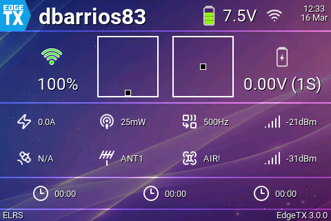
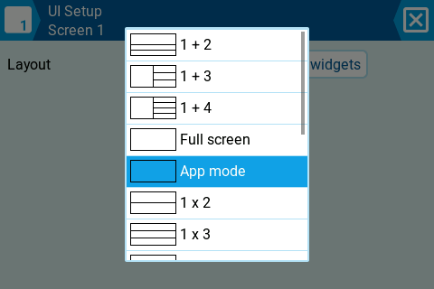
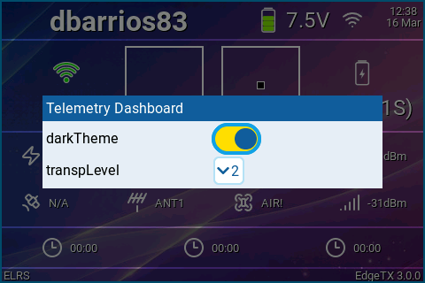

# edgetx-telemetry-dashboard
A modern telemetry dashboard widget for EdgeTX colour screen radios.

# EdgeTX Widgets Installation Guide

This guide explains how to install and configure the `FPVDASH` widget from this repository on an EdgeTX-compatible transmitter.

## Prerequisites

1. EdgeTX firmware installed on your radio.
2. A valid EdgeTX SD card contents pack for your firmware version.
3. A model with telemetry sensors discovered (recommended before final widget setup).
4. Supported target radios:

   **Primary target — 480 × 320 px:**
   RadioMaster TX15, TX15 Max · Jumper T15, T15 Pro

   **Compatible — 480 × 272 px:**
   RadioMaster TX16S, TX16S Mark II · Jumper T16, T18

## Installation Steps

### 1. Download the Widget Files
1. Clone or download this repository.
2. Use the `SCRIPTS/WIDGETS/FPVDASH` folder from this project.

### 2. Copy Files to the SD Card
1. Connect the radio to your computer with USB.
2. On the radio, select `USB Storage (SD)`.
3. Open the mounted SD card and go to `/WIDGETS/`.
4. Copy the `FPVDASH` folder (from `SCRIPTS/WIDGETS/FPVDASH` in this repo) into `/WIDGETS/`.
5. Confirm the final runtime path exists:
	 `/WIDGETS/FPVDASH/`

### 3. Bind and Discover Sensors
1. Power on radio and receiver.
2. Open **Model Settings** -> **Telemetry**.
3. Select **Discover new sensors** and wait for completion.
4. Optionally select **Stop discovery** and then **Delete all sensors / Rediscover** if sensor mapping looks stale.

### 4. Load the Widget on the Transmitter
1. Open the model display screen where you want the dashboard.
2. Enter widget layout setup (long press `PAGE` on most radios).
3. Select the telemetry screen and set it to `App Mode`.
4. Select a widget zone and choose `Telemetry Dashboard` (FPVDASH).

### 5. Configure Widget Options
The widget currently provides these options:
1. `darkTheme` (`BOOL`):
	 `On` = dark mode, `Off` = light mode.
2. `transpLevel` (`COMBO` where supported):
	 Controls section overlay transparency.

### 6. Test the Widget
1. Exit setup screens.
2. Verify top bar, sticks, context telemetry, timers, and footer render correctly.
3. Check live updates for LQ, RSSI, packet rate, battery, and satellite status.

## Telemetry Screen Setup (App Mode Required)

`FPVDASH` must be loaded on a telemetry screen configured in `App Mode`.
If the screen is not in `App Mode`, the widget may not load or may not render correctly.

## Widget Overview

`FPVDASH` is a full dashboard widget that includes:
- Model name and TX battery (top bar)
- Link status and key telemetry indicators
- Stick monitor
- Context telemetry grid (current, power, RF mode/packet rate, RSSI, satellites, antenna, flight mode)
- Timers row
- Footer with ELRS version and EdgeTX version

## Displayed Metrics

The dashboard can display these telemetry metrics and status values:
- TX battery voltage
- RX battery voltage / cell voltage
- Link Quality (LQ)
- Packet rate (decoded from RFMD when available)
- RSSI 1
- RSSI 2
- Current draw (A)
- TX power (mW)
- Satellite count
- Active antenna
- Flight mode
- Timer values (when enabled)
- ELRS module version
- EdgeTX firmware version
- Stick positions (R/T/A/E axes)

## Troubleshooting

- Widget not visible:
	Confirm files are under `/WIDGETS/FPVDASH/` and `main.lua` exists.
- Missing telemetry values:
	Re-run **Discover new sensors** in model telemetry settings.
- Stale values after switching drones:
	Use **Reset telemetry** from the model telemetry page.
- Version text or icons not updating:
	Power-cycle the radio after replacing widget files.

## Uninstallation

1. Open SD card contents.
2. Remove folder: `/WIDGETS/FPVDASH/`.

## Additional Resources

- EdgeTX Manual: https://manual.edgetx.org
- EdgeTX Website: https://www.edgetx.org/
- EdgeTX GitHub: https://github.com/EdgeTX