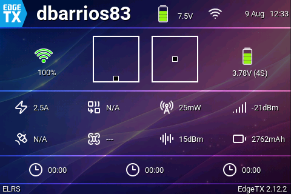
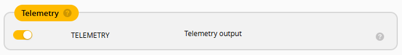
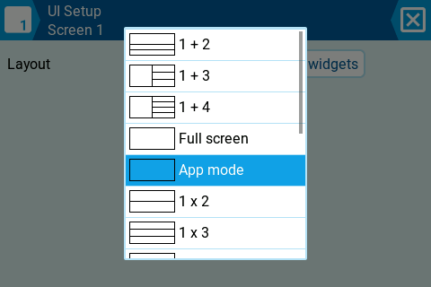
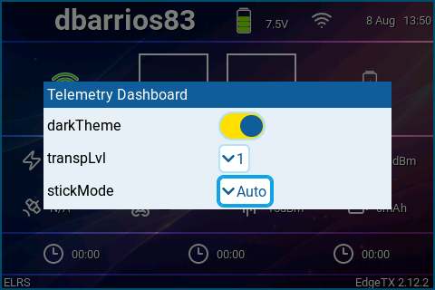

# edgetx-telemetry-dashboard
A modern telemetry dashboard widget for EdgeTX colour screen radios.

# EdgeTX Widgets Installation Guide

This guide explains how to install and configure the `FPVDASH` widget from this repository on an EdgeTX-compatible transmitter.



## Prerequisites

1. EdgeTX firmware **2.12 or later** installed on your radio (see
   [docs/platform/compatibility-matrix.md](docs/platform/compatibility-matrix.md)
   for per-radio version details — RadioMaster TX15 and Jumper T15 Pro
   specifically require 2.12).
2. A valid EdgeTX SD card contents pack for your firmware version.
3. In Betaflight, enable **Telemetry Output** in the **Receiver** tab.



4. A model with telemetry sensors discovered (recommended before final widget setup).
5. Supported target radios:

   **Primary target — 480 × 320 px:**
   RadioMaster TX15, TX15 Max · Jumper T15, T15 Pro

   **Compatible — 480 × 272 px:**
   RadioMaster TX16S, TX16S Mark II · Jumper T16, T18

   **Compatible — 800 × 480 px:**
   RadioMaster TX16S Mark III

## Installation Steps

### 1. Download the Widget Files
1. Clone or download this repository.
2. Use the `SCRIPTS/WIDGETS/FPVDASH` folder from this project.

### 2. Copy Files to the SD Card
1. Connect the radio to your computer with USB.
2. On the radio, select `USB Storage (SD)`.
3. Open the mounted SD card and go to `/WIDGETS/`.
4. Copy the `FPVDASH` folder (from `SCRIPTS/WIDGETS/FPVDASH` in this repo) into `/WIDGETS/`.
5. Confirm the final runtime path exists:
	 `/WIDGETS/FPVDASH/`

### 3. Bind and Discover Sensors
1. Power on radio and receiver.
2. Open **Model Settings** -> **Telemetry**.
3. Select **Discover new sensors** and wait for completion.
4. Optionally select **Stop discovery** and then **Delete all sensors / Rediscover** if sensor mapping looks stale.

### 4. Load the Widget on the Transmitter
1. Open the model display screen where you want the dashboard.
2. Enter widget layout setup (long press `PAGE` on most radios).
3. Select the telemetry screen and set it to `App Mode`.
4. Select a widget zone and choose `Telemetry Dashboard` (FPVDASH).



### 5. Configure Widget Options
The widget currently provides these options:
1. `darkTheme` (`BOOL`):
	 `On` = dark mode, `Off` = light mode.
2. `transpLvl` (`COMBO`/`Choice` where supported, plain numeric otherwise):
	 Controls section overlay transparency. Four levels, selected as "1"-"4"
	 (Choice) or 0-3 (plain numeric) depending on what your EdgeTX build
	 exposes -- both resolve to the same four transparency levels.



### 6. Test the Widget
1. Exit setup screens.
2. Verify top bar, sticks, context telemetry, timers, and footer render correctly.
3. Check live updates for LQ, RSSI, packet rate, battery, and satellite status.

## Telemetry Screen Setup (App Mode Required)

`FPVDASH` must be loaded on a telemetry screen configured in `App Mode`.
If the screen is not in `App Mode`, the widget may not load or may not render correctly.

## Widget Overview

`FPVDASH` is a full dashboard widget that includes:
- Model name and TX battery (top bar)
- Link status and key telemetry indicators
- Stick monitor
- Context telemetry grid (current, packet rate, TX power, RSSI, satellites, flight mode, RSNR, consumed capacity)
- Timers row
- Footer with ELRS version and EdgeTX version

## Behavior Notes

These notes explain safety-relevant or otherwise non-obvious widget
behavior. Full technical detail and sourcing:
[docs/platform/compatibility-matrix.md](docs/platform/compatibility-matrix.md).

**Battery cell count.** The widget infers cell count from pack voltage
when the flight controller doesn't report it explicitly, and *never
lets the inferred count decrease while the same pack stays connected*
— a draining 6S pack cannot be mistaken for a smaller, "full" pack
mid-flight. The count only resets when telemetry disconnects and
reconnects (a new connection may be a different pack). A battery
sensor that's discovered but genuinely reads 0V is shown as `0.00V`
with the critical/dead battery icon — a real zero reading is treated
as "dead," not "unknown"; only a sensor that was never discovered at
all shows the `--.--V` placeholder.

**Connection status.** "Connected" is based primarily on EdgeTX's own
telemetry-streaming signal (`getRSSI()`), not on any single
ExpressLRS-specific field — so a model reporting only generic sensors
(pack voltage, current, GPS, RSSI) is correctly shown as connected even
without link-quality or packet-rate telemetry.

**Missing vs. zero readings.** A sensor that isn't discovered on your
model shows as a placeholder (`--`, `N/A`), never as a fabricated `0`.
If a card looks blank, re-run **Discover new sensors** rather than
assuming the reading is genuinely zero.

**RFMD / packet rate.** See the RFMD metric below — packet rate
requires the transmitter's ExpressLRS version to be read from CRSF
device-info first, and only decodes rates from the table matching that
specific version (3.x or 4.x); an unrecognized version or RFMD value
never produces a guessed rate.

## Context Telemetry Metrics

The context section displays secondary telemetry used for pre-flight validation and post-flight analysis.
These metrics complement the primary safety indicators such as battery and link quality shown elsewhere in the dashboard.

###  CUR - Current (Amps)

What it shows:
Real-time current draw from the flight controller.

Why it matters:
Detects electrical issues before takeoff.

Typical values:
- Pre-flight: 0-1A
- Idle (armed, no throttle): 1-5A
- Hover: 5-20A depending on build

Warning signs:
- High current at idle can indicate motor, ESC, or short issues.
- Sudden spikes can indicate prop or wiring problems.

Usage:
- Pre-flight safety check
- Post-flight power analysis

###  RFMD - Packet Rate (Hz)

What it shows:
ExpressLRS packet rate, decoded from RFMD telemetry using a table selected by
the detected ELRS firmware major version (3.x or 4.x) -- see
[docs/platform/compatibility-matrix.md](docs/platform/compatibility-matrix.md)
for the full version/band tables and sourcing. RFMD is a raw firmware index,
not a rate value, and the same index means a different rate on 3.x vs 4.x, so
this card only decodes it once the transmitter's ELRS version has been read
from CRSF device-info. Until then, or for an ELRS version outside 3.x/4.x, it
shows unavailable rather than guessing.

Why it matters:
Confirms your control link configuration.

Typical values:
- 25 Hz, 50 Hz, 100 Hz, 150 Hz, 200 Hz, 250 Hz, 333 Hz, 500 Hz, 1000 Hz,
  depending on ELRS version, RF band (900MHz/2.4GHz/dual), and modulation
  (LoRa/FLRC/FSK).

Warning signs:
- Wrong rate can indicate an incorrect model profile.
- Unexpected changes can indicate dynamic mode issues.
- A persistent unavailable reading with an otherwise healthy link usually
  means the ELRS version hasn't been read yet (device-info exchange happens
  shortly after connecting) rather than a real fault.

Usage:
- Pre-flight configuration check

###  TPWR - TX Power (mW)

What it shows:
Current transmitter output power.

Why it matters:
Indicates link strength and dynamic power behavior.

Typical values:
- 10-1000 mW depending on setup

Warning signs:
- Stuck at low power can indicate a configuration issue.
- Constantly maxed-out power can indicate poor signal or antenna issues.

Usage:
- Pre-flight link validation
- Post-flight RF diagnostics

###  RSSI - Signal Strength (Best Antenna)

What it shows:
The best RSSI value from receiver antennas.

Why it matters:
Measures raw signal strength.

Typical values:
- -50 to -80 dBm: strong
- -90 to -100 dBm: weak

Warning signs:
- Very low RSSI can indicate an antenna issue.
- Large fluctuations can indicate interference or orientation problems.

Usage:
- Link diagnostics
- Antenna troubleshooting

###  SATS - GPS Satellites

What it shows:
Number of GPS satellites detected.

Why it matters:
Determines GPS reliability for functions such as return-to-home and position hold.

Typical values:
- 0-4: critical (no reliable fix — colored red)
- 5-7: usable (colored yellow)
- 8+: good (colored green)

These are the same thresholds the widget itself uses to color the card
(`telemetry/state.lua`'s `evaluateSatellites` and
`render/context.lua`'s `satStateColor`).

Special cases:
- `N/A`: no telemetry or GPS not detected

Usage:
- Pre-flight GPS readiness
- Post-flight GPS performance

###  FM - Flight Mode

What it shows:
Current flight mode from the flight controller.

Why it matters:
Prevents arming in the wrong mode.

Typical values:
- ANGLE
- HORIZON
- AIR
- ACRO

Warning signs:
- Unexpected mode can indicate switch misconfiguration.

Usage:
- Pre-flight verification

###  RSNR - Signal-to-Noise Ratio (dB)

What it shows:
Quality of the radio signal relative to background noise.

Why it matters:
Often more informative than RSSI alone for link quality.

Typical values:
- Greater than 10 dB: excellent
- 5-10 dB: good
- 0-5 dB: weak
- Less than 0 dB: poor

Warning signs:
- Low RSNR with good RSSI can indicate interference.
- Negative values can indicate an unstable link.

Usage:
- Link quality diagnostics
- Interference detection

###  CAP - Consumed Capacity (mAh)

What it shows:
Battery capacity consumed during the flight.

Why it matters:
Helps evaluate energy consumption and battery planning.

Typical values:
- Depends on battery size and flight style, for example 500-1500 mAh

Warning signs:
- Very high consumption can indicate an inefficient setup.
- Very low readings can indicate the sensor is not configured.

Usage:
- Post-flight analysis
- Battery planning

### Summary

The context section is intended to answer these operational questions:
- Is the drone safe to arm?
- Is the link configured and stable?
- Is the GPS ready?
- Did the system behave correctly after the flight?

In practice, it groups into:
- Pre-flight safety checks: CUR, RFMD, TPWR, SATS, FM
- Link diagnostics: RSSI, RSNR
- Post-flight insight: CAP

## Troubleshooting

- Widget not visible:
	Confirm files are under `/WIDGETS/FPVDASH/` and `main.lua` exists.
- Battery always shows `1S` regardless of actual cell count:
	In the Betaflight CLI, run:
	```text
	set report_cell_voltage = OFF
	save
	```
- Missing telemetry values:
	Re-run **Discover new sensors** in model telemetry settings.
- Stale values after switching drones:
	Use **Reset telemetry** from the model telemetry page.
- Version text or icons not updating:
	Power-cycle the radio after replacing widget files.
- Verifying a change before flashing a real radio:
	`lua tests/run.lua` (see [Running Tests](#running-tests) below) checks
	the widget's logic — telemetry decoding, thresholds, fallback
	behavior — but not layout or rendering. For a visual check, load the
	widget in **EdgeTX Companion**'s simulator using the
	`RadioMaster TX16S` (480x272) and `RadioMaster TX15` (480x320) radio
	profiles, matching the two supported display classes. See
	[docs/platform/compatibility-matrix.md](docs/platform/compatibility-matrix.md)
	Section 8 for the full simulator profile list and EdgeTX version
	notes (TX15 requires Companion built against EdgeTX 2.12+).

## Uninstallation

1. Open SD card contents.
2. Remove folder: `/WIDGETS/FPVDASH/`.

## Development

### Running Tests

The widget's Lua modules have a desktop test harness under `tests/` that
mocks the EdgeTX Lua API (`getFieldInfo`, `getValue`, `getFlightMode`,
`getTime`, `lcd.*`, `Bitmap.open`, CRSF push/pop) so unit tests can run on
any standard Lua 5.1-5.4 interpreter, without a radio or simulator.

Install Lua (e.g. `winget install DEVCOM.Lua` on Windows, or
`apt-get install lua5.4` on Linux), then from the repo root:

```bash
lua tests/run.lua
```

This syntax-checks every `.lua` file under `SCRIPTS/WIDGETS/FPVDASH` and
runs every spec in `tests/spec/`, printing a pass/fail summary and exiting
non-zero on failure. The same command runs in CI on every pull request
(`.github/workflows/lua-tests.yml`).

Some spec assertions are explicitly labeled `[Step N baseline]` — they lock
in current, known-incomplete behavior (tracked in the project's
Reliability & Compatibility plan) so that fixing it later is a deliberate,
visible change to the test rather than a silent one.

## Additional Resources

- EdgeTX Manual: https://manual.edgetx.org
- EdgeTX Website: https://www.edgetx.org/
- EdgeTX GitHub: https://github.com/EdgeTX
